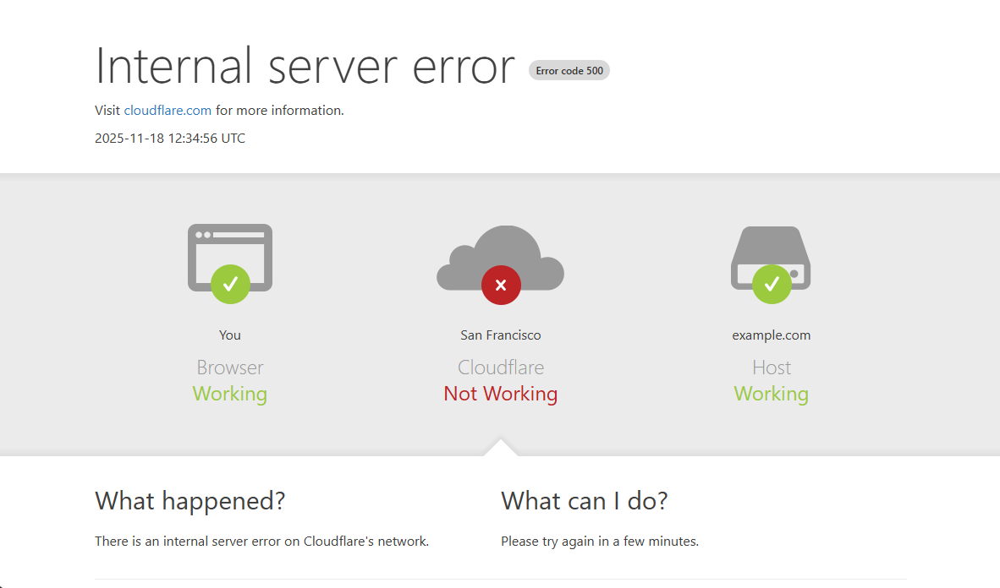

# Cloudflare Error Page Generator

## What does this project do?

This project creates customized error pages that mimics Cloudflare's error page. And you can embed it into your website.



## Quickstart

Install cloudflare-error-page using pip

``` Bash
pip install git+https://github.com/donlon/cloudflare-error-page.git
```

Then you can generate an error page based on parameters you like. (See [example.py](examples/example.py))

``` Python
import webbrowser
from cloudflare_error_page import render as render_cf_error_page

error_page = render_cf_error_page({
    'browser_status': {
        "status": 'ok',
    },
    'cloudflare_status': {
        "status": 'error',
        "status_text": 'Not Working',
    },
    'host_status': {
        "status": 'ok',
        "location": 'example.com',
    },
    'error_source': 'cloudflare',  # 'browser', 'cloudflare', or 'host'

    'what_happened': '<p>There is an internal server error on Cloudflare\'s network.</p>',
    'what_can_i_do': '<p>Please try again in a few minutes.</p>',
})

with open('error.html', 'w') as f:
    f.write(error_page)

webbrowser.open('error.html')
```

## More Examples

### Catastrophic infrastructure failure

``` Python
params =  {
    'title': 'Catastrophic infrastructure failure',
    'more_information': {
        "text": "cloudflare.com",
        "link": "https://youtube.com/watch?v=dQw4w9WgXcQ",
    },
    'browser_status': {
        'status': 'error',
        'status_text': 'Out of Memory',
    },
    'cloudflare_status': {
        'status': 'error',
        'location': 'Everywhere',
        'status_text': 'Not Working',
    },
    'host_status': {
        'status': 'error',
        'location': 'example.com',
        'status_text': 'On Fire',
    },
    'error_source': 'cloudflare',
    'what_happened': '<p>There is a catastrophic failure.</p>',
    'what_can_i_do': '<p>Please try again in a few years.</p>',
    'perf_sec_by': {
        "text": "Cloudflare",
        "link": "https://youtube.com/watch?v=dQw4w9WgXcQ",
    },
}
```


## Full Parameter Reference
``` JavaScript
{
    "html_title": "cloudflare.com | 500: Internal server error",
    "title": "Internal server error",
    "error_code": 999,
    "time": "2025-11-18 12:34:56 UTC",  // if not set, current UTC time is shown

    // Configuration for "Visit ... for more information" line
    "more_information": {
        "hidden": false,
        "text": "cloudflare.com", 
        "link": "https://youtube.com/watch?v=dQw4w9WgXcQ",
    },

    // Configuration for the Browser/Cloudflare/Host status
    "browser_status": {
        "status": "ok", // "ok" or "error"
        "location": "You",
        "name": "Browser",
        "status_text": "Working",
        "status_text_color": "#9bca3e",
    },
    "cloudflare_status": {
        "status": "error",
        "location": "Cloud",
        "name": "Cloudflare",
        "status_text": "Not Working",
        "status_text_color": "#bd2426",
    },
    "host_status": {
        "status": "ok",
        "location": "The Site",
        "name": "Host",
        "status_text": "Working",
        "status_text_color": "#9bca3e",
    },
    "error_source": "host", // Position of the error indicator, can be "browser", "cloudflare", or "host"

    "what_happened": "<p>There is an internal server error on Cloudflare's network.</p>",
    "what_can_i_do": "<p>Please try again in a few minutes.</p>",

    "ray_id": '0123456789abcdef',  // if not set, random hex string is shown
    "client_ip": '1.1.1.1',

    // Configuration for 'Performance & security by ...' in the footer
    "perf_sec_by": {
        "text": "Cloudflare",
        "link": "https://youtube.com/watch?v=dQw4w9WgXcQ",
    },
}
```